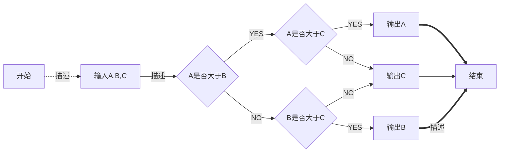

# MarkDown的使用

## 基础使用

### 标题

文字前面加#来表示，一个#是一级标题，二个#是二级标题，以此类推，最多支持六级标题。
```markdown
# 一级标题
## 二级标题
### 三级标题
#### 四级标题
##### 五级标题
###### 六级标题
```

### 字体

主要有斜体，加粗，斜体加粗，加删除线

*斜体*

```markdown
*斜体*
```

**加粗**

```markdown
**加粗**
```

***斜体加粗***

```markdown
***斜体加粗***
```

~~删除线~~

```markdown
~~删除线~~
```

### 引用

在引用的文字前加>即可。引用也可以嵌套，如加两个>>三个>>>,可以一直嵌套下去，只需要继续添加>即可

> 一级引用

```markdown
> 一级引用
```

> 一级引用
>
>> 二级引用

```markdown
>> 二级引用
```

### 分割线

三个或者三个以上的 - 或者 * 都可以

---

***

```markdown
*** 或 ---
```

### 图片


```

图片alt就是显示在图片下面的文字，相当于对图片内容的解释。
图片title是图片的标题，当鼠标移到图片上时显示的内容。title可加可不加
```

### 超链接

[百度](http://baidu.com '百度')

```csharp
[超链接名](超链接地址 "超链接title")
title可加可不加
```

注：Markdown本身语法不支持链接在新页面中打开，貌似简书做了处理，是可以的。别的平台可能就不行了，如果想要在新页面中打开的话可以用html语言的a标签代替

<a href="http://baidu.com" target="_blank">百度</a>

```xml
<a href="超链接地址" target="_blank">超链接名</a>
示例
<a href="http://baidu.com" target="_blank">百度</a>
```

自动链接：用尖括号包起来，就会自动被转成链接。一般网址的链接文字就和链接地址一样

<http://baidu.com>

### 代码

`单行代码`

```
`单行代码`
```

```
代码块
```

```
​```代码块```
```

### 列表

无序列表：用 - + * 任何一种都可以，注意文字前加空格

- 列表1
+ 列表2

* 列表3

```cpp
- 列表1
+ 列表2
* 列表3
```

有序列表：数字加点，注意文字前加空格

1. 列表1
2. 列表2
3. 列表3

```cpp
1. 列表1
2. 列表2
3. 列表3
```

列表嵌套：上一级和下一级之间敲三个空格即可

* 一级列表
   1. 二级列表

```cpp
* 一级列表
   1. 二级列表
```

### 表格
| 表头 | 表头 | 表头 |
| - | :-: | -: |
| 居左 | 居中 | 居右 |
| 居左 | 居中 | 居右 |

```ruby
表头|表头|表头
---|:--:|---:
居左|居中|居右
居左|居中|居右

第二行分割表头和内容。
- 有一个就行，为了对齐，多加了几个
文字默认居左
-两边加：表示文字居中
-右边加：表示文字居右
注：原生的语法两边都要用 | 包起来。此处省略
```

表格换行:加<br>

| 表头 |      表头      | 表头 |
| ---- | :------------: | ---: |
| 内容 | 内容 <br> 内容 | 内容 |
| 内容 |      内容      | 内容 |

```ruby
表头|表头|表头
---|:--:|---:
内容|内容 <br> 内容|内容
内容|内容|内容
```

### 转义

用\来实现转义字符的效果

```cpp
\\ 反斜线
\` 反引号
\* 星号
\_ 底线
\{ 左花括号
\} 右花括号
\[ 左方括号
\] 右方括号
```

### 代办清单

- [x] 已完成
- [ ]  未完成

```css
- [x] 已完成
- [ ] 未完成
```

## 进阶用法

### 流程图

```flow
st=>start: 开始
op=>operation: My Operation
cond=>condition: Yes or No?
e=>end
st->op->cond
cond(yes)->e
cond(no)->op
&```
```

```
​```flow
st=>start: 开始
op=>operation: My Operation
cond=>condition: Yes or No?
e=>end
st->op->cond
cond(yes)->e
cond(no)->op
&```
```



```
​```mermaid
graph LR
    start[开始] -.描述.-> input[输入A,B,C]
    input --描述--> conditionA{A是否大于B}
    conditionA -- YES --> conditionC{A是否大于C}
    conditionA -- NO --> conditionB{B是否大于C}
    conditionC -- YES --> printA[输出A]
    conditionC -- NO --> printC[输出C]
    conditionB -- YES --> printB[输出B]
    conditionB -- NO --> printC[输出C]
    printA ==> stop[结束]
    printC --> stop
    printB == 描述 ==> stop
​```
```

### 时序图

```seq
Alice->Bob: Hello Bob, how are you?
Note right of Bob: Bob thinks
Bob-->Alice: I am good thanks!
```

### 甘特图


### 公式

$$
E=mc^2
$$

```
$$
E=mc^2
$$
```


## 实用插件/脚本

### 自动编号

> - 打开链接：https://github.com/lipengzhou/typora-theme-auto-numbering下载脚本
> - 将仓库中的 `base.user.css` 和 `github.user.css` 两个文件都拷贝到主题目录中
> - 配置完成，重启 typora 文档内容标题就会有自动编号了

